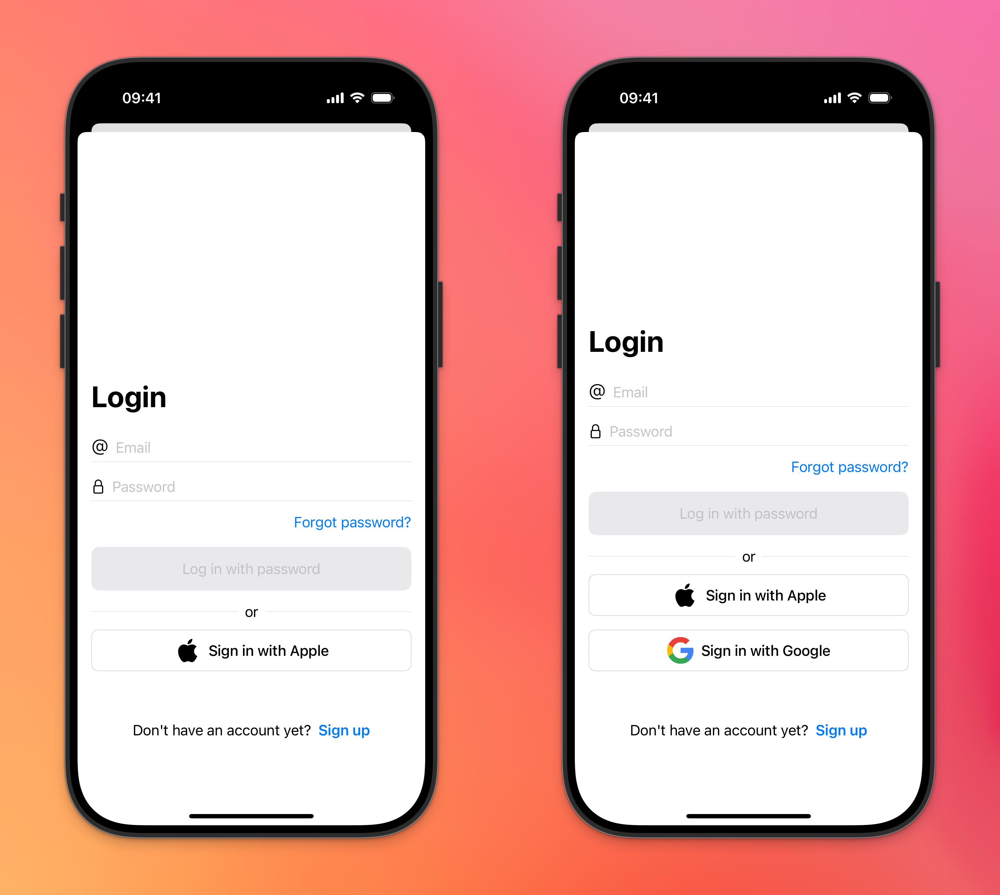

# IdentityKit

IdentityKit is a Swift package that provides a comprehensive authentication solution for your iOS apps. It seamlessly integrates with Firebase Authentication and offers multiple authentication methods, including email/password, Apple Sign-In, and more.



## Features

- 🔐 Multiple authentication methods:
  - Email and password authentication
  - Apple Sign-In
  - *(More methods coming soon)*
- 🔄 Complete user lifecycle management:
  - Sign up
  - Sign in
  - Password reset
  - Account deletion
- 🎨 Customizable UI components
- 🛡️ Robust error handling
- 📱 iOS 17+ support
- 🔌 Firebase Authentication integration

## Requirements

- iOS 17.0+
- Swift 6.0+
- Xcode 26.2+ (required for Firebase 12.x)

## Installation

### Swift Package Manager

Add IdentityKit to your project using Swift Package Manager by adding it to your `Package.swift` dependencies:

```swift
dependencies: [
    .package(url: "https://github.com/peterfriese/IdentityKit.git", from: "0.0.1")
]
```

Or add it directly in Xcode:
1. Go to File > Add Packages
2. Paste the repository URL: `https://github.com/peterfriese/IdentityKit.git`
3. Click Next and select the version you want to use

## Firebase Setup

1. Create a Firebase project in the [Firebase Console](https://console.firebase.google.com/)
2. Add an iOS app to your Firebase project
3. Download the `GoogleService-Info.plist` file and add it to your app
4. Enable the authentication methods you want to use in the Firebase Console

## Quick Start

### Initialize Firebase

```swift
import FirebaseCore
import IdentityKit

class AppDelegate: UIResponder, UIApplicationDelegate {
    func application(_ application: UIApplication, didFinishLaunchingWithOptions launchOptions: [UIApplication.LaunchOptionsKey: Any]?) -> Bool {
        FirebaseApp.configure()
        return true
    }
}
```

### Present Authentication Screen

```swift
import SwiftUI
import IdentityKit

struct ContentView: View {
    @State private var showAuthScreen = false
    
    var body: some View {
        Button("Sign In") {
            showAuthScreen = true
        }
        .sheet(isPresented: $showAuthScreen) {
            AuthenticationScreen()
        }
    }
}
```

### Enable Authentication Providers

You can specify which authentication providers to enable in your application using SwiftUI view modifiers:

```swift
import SwiftUI
import IdentityKit

struct ContentView: View {
    @State private var showAuthScreen = false
    
    var body: some View {
        Button("Sign In") {
            showAuthScreen = true
        }
        .sheet(isPresented: $showAuthScreen) {
            AuthenticationScreen()
                .authenticationProviders([.email, .apple])
        }
    }
}
```

Remember to enable these same authentication providers in the Firebase Console to ensure they work properly.

### Handle Authentication State

```swift
import SwiftUI
import IdentityKit

struct MainView: View {
    @StateObject private var authService = AuthenticationService.shared
    
    var body: some View {
        Group {
            if authService.isAuthenticated {
                // Show authenticated content
                AuthenticatedView()
            } else {
                // Show authentication screen
                AuthenticationScreen()
            }
        }
        .onAppear {
            // Check authentication state
            authService.updateAuthenticationState()
        }
    }
}
```

## Advanced Usage

### Custom Authentication UI

You can customize the authentication UI by creating your own views and using IdentityKit's authentication services:

```swift
import SwiftUI
import IdentityKit

struct CustomAuthView: View {
    @StateObject private var authService = AuthenticationService.shared
    @State private var email = ""
    @State private var password = ""
    @State private var errorMessage = ""
    
    var body: some View {
        VStack {
            TextField("Email", text: $email)
                .textContentType(.emailAddress)
                .keyboardType(.emailAddress)
            
            SecureField("Password", text: $password)
                .textContentType(.password)
            
            if !errorMessage.isEmpty {
                Text(errorMessage)
                    .foregroundColor(.red)
            }
            
            Button("Sign In") {
                Task {
                    do {
                        try await authService.signInWithEmail(email: email, password: password)
                    } catch let error as AuthenticationError {
                        errorMessage = error.localizedDescription
                    } catch {
                        errorMessage = "An unknown error occurred"
                    }
                }
            }
            
            Button("Sign In with Apple") {
                Task {
                    do {
                        try await authService.signInWithApple()
                    } catch let error as AuthenticationError {
                        errorMessage = error.localizedDescription
                    } catch {
                        errorMessage = "An unknown error occurred"
                    }
                }
            }
            .buttonStyle(SocialAuthenticationButtonStyle(provider: .apple))
        }
        .padding()
    }
}
```

## License

IdentityKit is available under the MIT license. See the LICENSE file for more info.

## Contribution

Contributions are welcome! Please feel free to submit a Pull Request. 